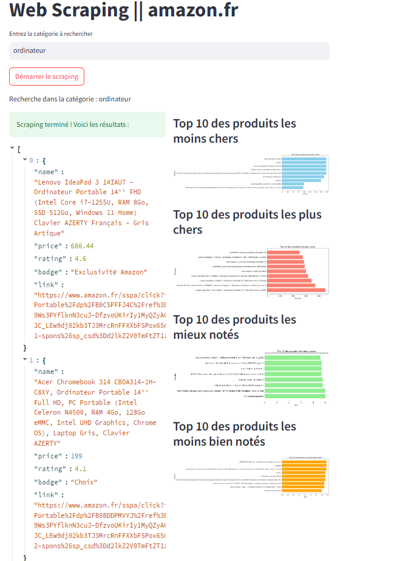

# Amazon Scraper & Analyzer

## Description
Ce projet est une application de scraping web et d'analyse de données permettant d'extraire des informations sur les produits disponibles sur **Amazon.fr**.

Avec une interface utilisateur simple basée sur **Streamlit**, cette application offre des analyses visuelles des données récoltées, notamment les produits les moins chers, les plus chers, et ceux avec les meilleures ou pires évaluations.

---

## Fonctionnalités
- **Scraping de produits sur Amazon.fr** pour une catégorie spécifique.
- Extraction des données suivantes :
  - Nom du produit
  - Prix
  - Évaluation moyenne (note)
  - Badge (par ex., "Meilleure vente")
  - Lien vers la page produit
- **Visualisations interactives**
  - Top 10 des produits les moins chers
  - Top 10 des produits les plus chers
  - Top 10 des produits les mieux évalués
  - Top 10 des produits les moins bien évalués
- **Exportation des résultats** au format JSON.

---

## Installation

**Cloner le dépôt** :
   ```bash
   git clone https://github.com/Berenger2/amazon_scraper.git
   cd amazon_scraper
   ```
 

## Utilisation

### Interface utilisateur
1. Lancez l'application avec la commande `streamlit run app.py`.
2. Entrez une catégorie de produit (par exemple : "smartphones", "ordinateur") dans le champ de texte.
3. Cliquez sur **Démarrer le scraping** pour lancer la collecte de données.
4. Une fois le scraping terminé, vous pourrez :
   - Explorer les résultats affichés dans l'interface.
   - Visualiser les graphiques interactifs.
   - Télécharger les résultats au format JSON.

### Exportation
Les résultats sont sauvegardés dans un fichier `amazon_results.json`, que vous pouvez également télécharger directement via l'interface Streamlit.


## Dépendances
- **Python >= 3.7**
- **Scrapy** : Framework pour le scraping web.
- **Streamlit** : Création d'interfaces interactives.
- **Pandas** : Manipulation des données.
- **Matplotlib** : Visualisation des données.

Installez les dépendances avec la commande :
```bash
pip install -r requirements.txt
```

## **Interface principale**
Exemple de graphiques interactifs générés par l'application :


## Avertissement
Ce projet est destiné à un usage personnel et éducatif uniquement. Le scraping de sites web peut enfreindre leurs conditions d'utilisation. Veuillez utiliser cette application de manière responsable.

